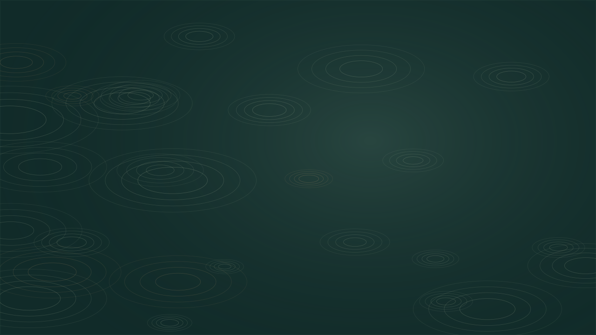

# Soft Fascination Studio

**A small, local-first instrument for slower images.**

Create deterministic generative loops inspired by rain, water and leaves. Designed for independent artists, filmmakers, creative coders and small studios who want editable visuals without a cloud account, subscription, external media or a GPU framework.

[简体中文](README.zh-CN.md) · [User guide](docs/USER_GUIDE.md) · [Engine API](docs/API.md) · [Validation](docs/VALIDATION.md)




## Use it now

[Open the live studio](https://adambsp-git.github.io/soft-fascination-studio/) — no account or installation required.

Download this repository and open **`studio.html`** in a modern desktop browser. The complete editor, styles and renderer are embedded in that file. No installation or network is required. Start playback explicitly with **Play**.

If your browser restricts local files or downloads, use the local server:

```sh
# Requires Node.js 22 or newer. No npm install is needed.
npm start
# Open http://127.0.0.1:4173
```

## What works in v0.2.0

- Three built-in presets with complete, editable compositions.
- Undo/redo for the last 50 composition changes, including imports and resets.
- Three original procedural scenes: rain lines, water ripples and a drifting canopy.
- Three palettes; repeatable numeric seeds; density, amplitude and loop-duration controls.
- Landscape, portrait, square and Full HD output, plus imported custom sizes within limits.
- Scrubbing, explicit play/pause, and fullscreen where the browser supports it.
- English and Simplified Chinese interface; local preset persistence.
- Validated JSON preset import/export; SVG and browser-rendered PNG stills.
- A self-contained HTML loop player that works offline and starts paused.
- A Node CLI for deterministic SVG frame sequences with exact loop timing.
- A reusable pure-JavaScript SVG engine, with no runtime or build dependencies.

No video encoder, audio generation, live sensor connection or clinical feature is included. Use a compatible compositor to rasterize the SVG sequence and encode video. See [export instructions](docs/USER_GUIDE.md).

## Example: a reproducible composition

```js
import {renderSVG} from './src/engine.js';
import {DEFAULT} from './src/config.js';

const svg = renderSVG({...DEFAULT, scene: 'water', seed: 1987}, 3);
// Same configuration + same time => same SVG string.
// renderSVG(config, 0) === renderSVG(config, config.duration)
```

```sh
npm run frames -- examples/lake.json output-frames 24
```

This writes 288 SVG frames for a 12-second loop and a manifest. It excludes the duplicated endpoint. The output directory must not already exist.

## Development

```sh
npm run build  # rebuild index.html, studio.html, web/runtime-source.js and dist/
npm run check  # check JavaScript syntax
npm test       # unit and local integration tests using Node's built-in runner
npm start
```

`index.html`, `studio.html` and `web/runtime-source.js` are generated and committed so a fresh download runs without a build. Regenerate them after changing source. `dist/` is disposable and ignored. Both the standalone entry and the modular static build support subdirectory hosting. See [hosting instructions](docs/HOSTING.md) and the [validation record](docs/VALIDATION.md) for CI and browser results.

## Why this project exists

A.D.A.M works at the intersection of art, design and code. This project translates that practice into a small reusable software instrument: a shareable preset becomes both an artwork recipe and a reproducible bug report. It is useful even when no AI service is available.

“Soft fascination” is an artistic inspiration here. The software does **not** measure attention, target a brain network, offer breathing instructions, or claim therapeutic or cognitive benefits. The scenes are stylized patterns, not physical simulations.

## Privacy and motion

The app has no analytics, accounts, cookies, third-party requests or API keys. Preferences are stored under `sfs:config` and `sfs:language` in browser local storage when available. Files leave the app only through user-selected exports. Playback starts paused, stops when the page is hidden, and stops if reduced-motion preferences are enabled while playing. Users can choose to play after that. The animated art is decorative; controls have labels and keyboard access. Formal accessibility and cross-browser audits remain pending.

## Status and contribution

This is a newly created initial implementation, prepared with substantial AI coding assistance and automated tests. There is no established adoption, contributor community, usage count or long-term maintenance record to report. Do not infer one from the documentation. See [provenance](docs/PROVENANCE.md) and [roadmap](docs/ROADMAP.md).

Contributions are welcome: report reproducible issues, test a browser, improve translations or add a scene with deterministic timing. Read [CONTRIBUTING.md](CONTRIBUTING.md), [CODE_OF_CONDUCT.md](CODE_OF_CONDUCT.md), and [SECURITY.md](SECURITY.md).

Project lead: **ZHANG ZUNAI / A.D.A.M**. Source, original procedural examples and documentation are supplied under the [MIT license](LICENSE). The project name and A.D.A.M name do not imply endorsement of derivative projects.
