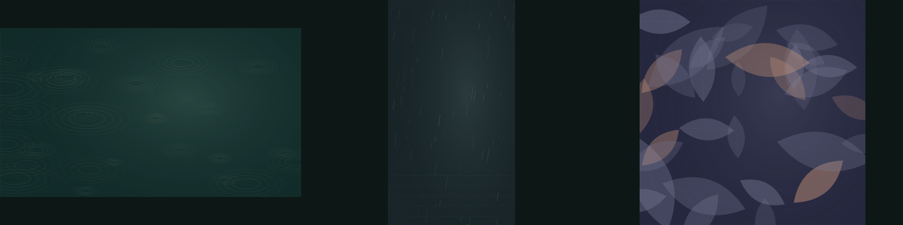

# Soft Fascination Studio

**为缓慢的影像，留下一点空间。**

这是 A.D.A.M 的独立创意编码工具，以雨、水面与树冠为灵感，生成可重复、可调节的循环视觉。适用于短视频素材、影像实验和装置原型。

[English](README.md) · [操作指南](docs/USER_GUIDE.md) · [测试记录](docs/VALIDATION.md)



## 立即使用

[打开在线工作室](https://adambsp-git.github.io/soft-fascination-studio/)，无需账号或安装。

下载并解压后，直接用桌面浏览器打开 `studio.html`。这是包含界面、样式和引擎的完整离线文件，不需要注册、联网或安装依赖。默认静止，按「播放」开始。

如果浏览器限制本地文件，安装 Node.js 22 或以上版本后，在项目目录运行：

```sh
npm start
```

打开 `http://127.0.0.1:4173`。无需运行 `npm install`。

## 0.2.0 已实现

- 三组内置场景预设，一键开始创作。
- 最近 50 步构图撤销与重做，支持恢复导入前或重置前的作品。

- 雨线、水波、树冠三种视觉，以及苔绿、暮色、水墨三套色调。
- 可重现的随机种子，密度、运动幅度、循环时长控制。
- 横屏、竖屏、方形、Full HD 画幅。
- 播放、暂停、时间轴和浏览器支持时的全屏。
- 简体中文与英文界面，本地保存参数。
- JSON 预设导入导出，SVG 和 PNG 静帧，离线 HTML 循环播放器。
- 命令行批量导出 SVG 帧序列及时间清单。
- 无外部依赖的模块化视觉引擎、自动化测试与 GitHub CI 配置。

```sh
npm run frames -- examples/lake.json output-frames 24
```

导出 12 秒、24 fps 共 288 帧 SVG。需要用你的视频软件或合成工具转成位图序列后编码；项目本身不包含 MP4 编码器。

## 开发

```sh
npm run build
npm run check
npm test
```

修改源代码后重建 `index.html`、`studio.html` 和 `web/runtime-source.js`。`dist/` 是可再生成的静态部署目录。

## 实际边界

这是新的开源项目，有 AI 编程辅助。仓库和在线演示已公开，0.2.0 的 GitHub CI 已在 Node 22 和 24 上通过。本地 24 项测试通过，在线编辑器已完成 Chrome 核心交互检查；跨浏览器和真实手机验收仍待完成。没有已建立的用户规模、长期维护记录或外部社区贡献。详细证据见测试记录。

项目受自然节律启发，但不宣称能够改变默认模式网络、治疗疾病或改善注意力。它不是呼吸训练或医疗工具。播放默认关闭；页面隐藏时暂停。

项目负责人：ZHANG ZUNAI / A.D.A.M。代码、程序生成的示例和文档使用 MIT 许可证。
